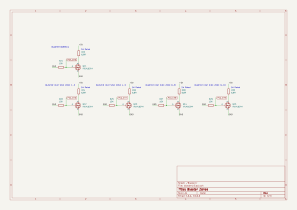

# Blaster Arm

*Reaver Titan Lighting System — Emperor's Children Build*

The laser blaster is the most complex lighting zone. It uses 6 PCA9685 channels to create a multi-state firing sequence across the barrels and heatsink. Each channel is driven through an N-channel MOSFET. The weapon body, barrels, and heatsink are printed in clear resin.

When mounted in the left socket, the blaster uses Ch 0–5. When mounted in the right socket, it uses Ch 6–11. The firmware applies the correct offset based on weapon ID detection at boot — the weapon arm itself does not change. See [arms.md](arms.md) for the full arm pool and socket architecture.

Channel references below use left socket numbering (Ch 0–5). Substitute Ch 6–11 for right socket.

---

## Body

### Dimensions

| Feature | From (cap end) | Length | Notes |
|---------|---------------|--------|-------|
| Removable cap | 0mm | 7.5mm | Service access for heatsink harness — no wires exit here |
| Cap gap | 7.5mm | 1mm | Clearance between cap and fins |
| Heatsink fins | 8.5mm | 35.7mm | 33.6mm OD at gaps; 31.6mm OD at core extension |
| Core extension | 44.2mm | 1.342mm | 31.6mm OD; protrudes past last fin, mates with hollow body |
| Hollow body | 45.542mm | 81.458mm | Wire routing, inline resistors |
| Barrel face | 127mm | — | Barrel assembly connects here |

Total body length cap to barrel face: **127mm**.

### Cross-Section (Forward of Heatsink)

27mm × 41mm rectangle plus a cylinder centered on the bottom face, extending the full length of the hollow body to the barrel face. Two barrel bores sit in the upper rectangle (left and right), one barrel bore in the bottom cylinder — triangular arrangement matching the three-barrel layout.

### Arm Connection

Ring magnet (15mm OD, 10mm ID) recessed into the top face, centered at 70mm from the cap. All 9 wires (+5V, GND, ID, Ch_A–F) pass through the 10mm center hole into the arm. Arm-to-shoulder uses the same ring magnet design; may be a fixed joint if the rotational connection proves too weak.

### Access Panel

17mm × 35mm rectangular opening on the top face, from approximately 87.5mm to 124mm from the cap (beginning ~10mm forward of the ring magnet edge, stopping 3mm short of the barrel face). Provides wire management access to the forward hollow body section.

### Wire Routing

9 wires enter through the ring magnet hole at 70mm and route in both directions through the hollow body:

- **Rearward (~24.5mm):** to the heatsink core front face at 45.542mm, then through the core interior to each zone
- **Forward (~57mm):** to the barrel assembly JST connector at the barrel face

Heatsink inline resistors (10× 6.8Ω 1W — 2 per zone × 5 zones) mount in the hollow body between the core front face (45.542mm) and the ring magnet near edge (~62.5mm). Accessible when the service cap is removed.

---

## Barrels — Channel 0

Three barrels arranged in a triangle (two upper, one lower), each with an 8mm bore. Lit by green LED rope (1.5mm overall diameter including green silicone diffusion sleeve, Vf 2.7–3.1V, max 300mA) wrapped around a printed helical core inside the barrel. The silicone sleeve diffuses light into a smooth continuous glow with no visible point sources. All three barrels are driven as a single synchronised zone from Ch 0 via MOSFET driver. LED rope cannot be cut — all insert designs are modelled around fixed rope lengths.

### Physical Design

Each barrel is 105.9mm total. The clear diffusing section begins at 25.1mm from the breech.

| Section | From (breech) | To | Length | Inner dia. | Notes |
|---------|--------------|-----|--------|------------|-------|
| Opaque mounting | 0mm | 25.1mm | 25.1mm | — | Connects to weapon body |
| Main clear bore | 25.1mm | 75.9mm | 50.8mm | 8mm | Helical core seats here |
| Helix section | 27.1mm | 75.1mm | 48mm | 8mm | Active rope coil |
| 5.4mm bore | 75.9mm | 105.9mm | 30mm | 5.4mm | Existing feature; rope tail runs to tip |
| Tapered section | 93.7mm | 105.9mm | 12.2mm | 5.4mm | OD tapers 12mm → 8.7mm |

**Helical core parameters:**

| Parameter | Value |
|-----------|-------|
| Core OD | 5mm |
| Core wall | 1.5mm |
| Central wire channel | 2mm diameter |
| Barrel bore | 8mm |
| Helix pitch | 3.63mm |
| Gap between coils | 2.13mm |
| Rope in helix | 270mm (~13 turns) |
| Rope tail (into 5.4mm bore) | 30mm |

Rope installs tip-first: the tip lead threads back through the 2mm central wire channel and exits at the breech end of the helix alongside the start lead. Both leads route through the 25.1mm opaque mounting section to the connection point inside the weapon body.

**Assembly:** All three barrels form one removable assembly. A solid plug section (~7.8mm diameter) at the breech of each helical core seats in the 8mm barrel face bore. Magnets in the plug faces retain the assembly. A 2-pin JST connector just inside the barrel face carries the only two wires crossing the barrel-to-body interface: +5V and the Ch_A drain return (all three rope anodes and cathodes bundle together inside the assembly).

---

## Heatsink — Channels 1–5

11 fins with 10 gaps between them. An internal harness (up to 27mm diameter) houses LED rope segments (same 1.5mm silicone-sleeved rope as the barrels) positioned to shine through the gaps and reflect off the fin surfaces. The silicone sleeve provides even light spread without hot spots. Each zone is driven via its own MOSFET driver.

The 10 gaps are grouped into 5 equal zones of 2 gaps each for directional animation:

| Zone | Gaps | Ch (left socket) | Ch (right socket) | Position |
|------|------|-----------------|------------------|----------|
| Front | 9–10 | 1 | 7 | Muzzle end (closest to barrels) |
| Mid-front | 7–8 | 2 | 8 | |
| Mid | 5–6 | 3 | 9 | |
| Mid-rear | 3–4 | 4 | 10 | |
| Rear | 1–2 | 5 | 11 | Reactor end (energy origin) |

### Physical Design

**Heatsink cylinder:** 33.6mm OD at fin gaps; 31.6mm OD at core extension; fins arrayed on the outside.

**Bore:** D-shaped, 29.64mm diameter — matched to removable cap OD. D-flat offset 2mm from top, chord ~14.87mm. D-flat faces up (same side as ring magnet), aligned with the horseshoe opening of the core.

**Core (wiring harness):** Horseshoe-shaped, 29mm OD. Open on the top face (same side as ring magnet), with arms angling inward at 45° to partially close the gap — giving direct access to the fully open hollow interior for wire and rope end routing. Interior runs open the full length with no bridges between zones; rope ends from each annular slot route through the horseshoe opening into the interior. Extends fully through all five zones plus 1.342mm past the fins to mate with the body (~37.042mm total length).

| Feature | Value |
|---------|-------|
| OD | 29mm |
| Wall thickness | 3mm |
| Hollow interior diameter | 23mm |
| D-flat chord width | ~14.7mm |
| D-flat offset from top | 2mm |
| Opening position | Top face |
| Arm inward angle | 45° |

**Fins and gaps:**

| Feature | Value |
|---------|-------|
| Total fin array length | 35.7mm |
| Fins | 11 × 1.75mm wide |
| Gaps | 10 × 1.645mm wide |
| Zone count | 5 (2 gaps per zone) |
| Zone pitch (slot center to slot center) | 6.79mm |

**Annular rope slots:** One slot per zone, centered on the middle fin of each zone's gap pair. Rope sits 0.5mm proud of the core OD.

| Feature | Value |
|---------|-------|
| Width | 2mm |
| Depth | 1mm |
| Count | 5 (one per zone) |

**Slot positions:**

| Zone | From core front face | From cap |
|------|---------------------|---------|
| Front | 4.27mm | 12.77mm |
| Mid-front | 11.06mm | 19.56mm |
| Mid | 17.85mm | 26.35mm |
| Mid-rear | 24.64mm | 33.14mm |
| Rear | 31.43mm | 39.93mm |

**Wire exits:** 6 wires exit the core front face into the hollow body: 1 shared +5V trunk and 5 individual drain returns (Ch 1–5).

**Prototype validation (v1):** Fit confirmed — core seats in bore with adequate clearance. Rope sits in annular slots against the bore wall, providing good light contact into the fin gaps. Rope end slack from each zone crosses inside the horseshoe opening in an X pattern; manageable at this stage.

**Rope end retention (next iteration):** Alternating arches or tabs spanning the horseshoe opening will be added to the core to hold the X-crossed rope ends in place. Count and spacing TBD.

---

## Firing Sequence

The heatsink houses the weapon's reactor. All energy originates at the rear and propagates forward through the heatsink zones toward the barrels. The rear heatsink zone is always the origin point — it lights first, dims last, and never fully goes dark.

### IDLE

Faint glow in the rear heatsink zone only (Ch 5, gaps 1–2). All other zones dark. The reactor is ticking over at standby power.

### PRIME

Rear heatsink zone brightens. Energy propagates forward sequentially: rear (Ch 5) reaches full brightness first, then mid-rear (Ch 4), mid (Ch 3), mid-front (Ch 2), then front (Ch 1). Each zone reaches mid-brightness before the next begins — an overlapping forward surge. Barrels remain dark during this phase.

### FULL CHARGE

All five heatsink zones at full brightness. Barrels (Ch 0) now ramp up as the energy reaches the muzzle end. Everything fully lit with a subtle oscillation or flicker suggesting barely contained power.

### DISCHARGE

Barrels flash bright. The heatsink performs a fast rear-to-front pulse — a final surge of energy shoved forward from the reactor through the weapon and out the barrels. Everything then fades front-to-back: barrels dim first, then front heatsink zone, mid-front, mid, mid-rear. The rear zone stays lit longest as the reactor remains hot, then gradually dims back down to idle glow. The cycle can then repeat.

---

## Schematic

Each of the 6 blaster channels uses an IRLML6344 N-channel MOSFET (SOT-23 package) to switch the LED rope. The circuit per channel:

**Why a MOSFET?** The PCA9685 is limited to 25mA per output channel. Each LED rope segment draws well above that limit — exceeding the 25mA limit. The MOSFET solves this by acting as a high-current switch: the PCA9685 controls the gate using only a tiny signal current, while the MOSFET handles the full LED load between drain and source. The controller stays safe; the MOSFET does the heavy lifting.

**MOSFET:** IRLML6344 (SOT-23). Logic-level N-channel, fully switches on at 3.3V gate voltage, handles >4A continuous drain current.

**10kΩ gate pull-down:** Prevents LED flicker during power-up before the PCA9685 initialises.

**Inline resistor strategy:** Series resistors live inside the weapon arm, not on the torso junction board. The torso board is weapon-agnostic. Each channel's resistor is sized for the number of ropes in parallel on that channel so every rope sees the same current and brightness regardless of channel.

**Bench measurements (4.88V USB supply):**

| Rope | Vf measured | Current at 6.8Ω |
|------|------------|----------------|
| 5.11" heatsink | 2.76V | 303mA |
| 11.81" barrel | 2.77V | 310mA |

V_available = 4.88 − 2.77 = **2.11V**. An earlier measurement of 72mA was taken without a MOSFET in circuit and is incorrect — disregard.

**Target: 154mA per rope** — empirically validated on the bench as the brightness sweet spot. At this level two blasters simultaneously draw ~2.5A from the 5V rail, within the 3A buck converter budget with headroom for head and torso zones.

| Channel | N ropes | Inline resistor | I per rope | Resistor dissipation |
|---------|---------|----------------|------------|---------------------|
| Ch 0 — Barrels | 3 in parallel | 4.7Ω 2W | ~150mA | ~0.95W |
| Ch 1–5 — Heatsink | 1 each (5 ropes total) | 13.6Ω (2× 6.8Ω 1W in series) | ~155mA | ~0.16W per resistor |

**Trigger method:** Dedicated button on the ESP32-S3 web UI initiates the firing sequence. Timed automatic loops and display mode presets are also supported. Physical GPIO button input is available as an alternative.

---

## Bill of Materials — Blaster Zone

| Component | Product | Qty | Source | Status | Notes |
|-----------|---------|-----|--------|--------|-------|
| **MOSFET** | IRLML6344TRPBF (Infineon, SOT-23) | 10–20 | Digi-Key | Arrived | N-channel logic-level MOSFET, SOT-23. Fully switches at 3.3V gate, handles >4A drain. Buy genuine from Digi-Key — counterfeits common on Amazon. |
| **Heatsink inline resistor** | TE Connectivity ROX1SJ6R8 (6.8Ω 1W metal oxide axial) | 10 per arm | Digi-Key | Arrived | 2 in series per heatsink zone × 5 zones = 10 per arm. Each dissipates ~0.16W. |
| **Barrel inline resistor** | 4.7Ω 2W axial | 1 per arm | TBD | To order | Single resistor for Ch 0 (3 barrel ropes in parallel). Dissipates ~0.95W — must be 2W rated. |
| **Gate pull-down resistor** | 10kΩ ¼W carbon film | 6 | On hand | Arrived | From Arduino starter kit. |
| **Barrel LED rope** | Green silicone-sleeved LED rope, 1.5mm — 11.81" lengths | 3 | On hand | Arrived | One per barrel. Cannot be cut — barrel inserts modelled around this length. |
| **Heatsink LED rope** | Green silicone-sleeved LED rope, 1.5mm — 5.11" lengths | 5 | On hand | Arrived | One per heatsink zone (Ch 1–5). Cannot be cut — heatsink harness modelled around this length. |
| **SOT-23 breakout boards** | SOT-23 to DIP adapter breakout boards | 5–10 | Amazon | Arrived | For breadboard prototyping. One per blaster channel. |